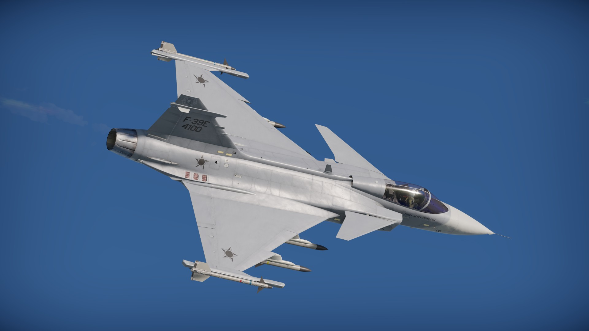

# Projeto War Thunder Fighter Jets
Este é um projeto pessoal criado no intuíto de misturar um assunto que eu gosto com o conteúdo que estou aprendendo através do curso <b>DevQuest</b>, <b>BlackBox AI</b>, <b>faculdade</b> e <b>vídeos no youtube</b>.

Meu objetivo com esse projeto é registrar várias versões que mapeiam o meu progresso na programação front-end ao back-end, alcançando um resultado onde esse site possa se tornar uma base para entusiastas do jogo War Thunder se informarem e aprenderem a como melhorar seu desempenho com determinado veículo dentro do jogo.

## Missões:
- Criar uma página modelo completa para posteriormente jogar ela para outro título.html, criar uma página de início no index.html, por fim fazer novas páginas sobre outros veículos.
- Na página de apresentação sobre o veículo, quero aprender a como fazer um efeito de reflexo onde além do png também se reflita o texto (nome do veículo + frase curta). Isso é algo onde já passei 1 dia tentando descobrir como fazer mas ainda não obtive resultados.
- Desenolver uma seção de tutorial de controles interativo para cada mecânica do veíuclo e seu armamento.
- Montar uma área para interação entre usuários para que seja possível compartilhar novas dicas ou ajudar outros jogadores.

[](http://warthunder.com/en/registration?r=userinvite_136790172)

## Tecnologias utilizadas
- HTML
- CSS

## Como utilizar

clone para o projeto
```
git clone
```
